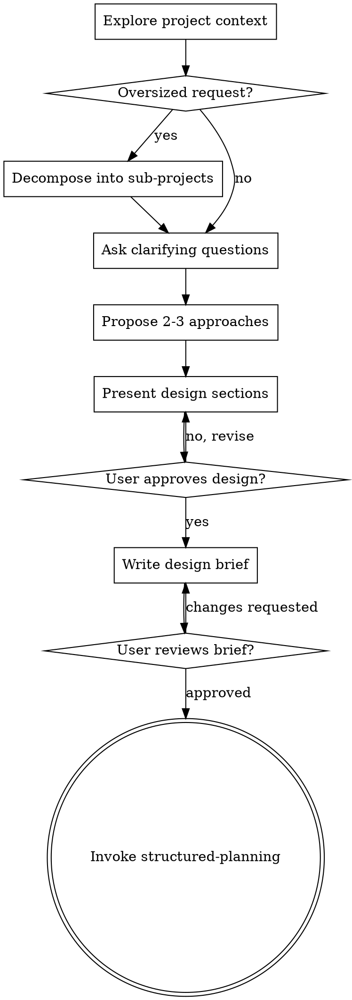

# Brainstorming Ideas Into Designs

Help turn ideas into fully formed designs and specs through natural collaborative dialogue.

Start by understanding the current project context, then ask questions one at a time to refine the idea. Once you understand what you're building, present the design and get user approval.

This skill is for exploration and framing, not for producing the final implementation plan.

## AskUser Safety

If you use the `AskUser` tool while clarifying requirements, use plain text only.

Do not send JSON.
Do not wrap the questionnaire in code fences.
Do not add headings, explanations, or prose before the questionnaire block.

Use only the exact marker format expected by the parser:

[question] Your question here
[topic] Short topic here
[option] First option
[option] Second option

Each `[question]` block must include 2 to 10 `[option]` lines.

If you are asking in normal chat rather than intentionally using `AskUser`, write the question in ordinary prose instead.

<HARD-GATE>
Do NOT invoke any implementation skill, write any code, scaffold any project, or take any implementation action until you have presented a design and the user has approved it.
</HARD-GATE>

## Anti-Pattern: "This Is Too Simple To Need A Design"

Every project goes through this process. A todo list, a single-function utility, a config change, all of them. "Simple" projects are where unexamined assumptions cause the most wasted work. The design can be short for truly simple projects, but you must still present it and get approval.

## Checklist

You must complete these items in order:

1. Explore project context — check files, docs, and recent commits when relevant
2. Ask clarifying questions — one at a time, understand purpose, constraints, and success criteria
3. Propose 2-3 approaches — include trade-offs and your recommendation
4. Present design — in sections scaled to complexity, get user approval after each section
5. Write design brief — save to `docs/plans/<topic>-YYYY-MM-DD-design.md`
6. User reviews written brief — ask the user to review the file before proceeding
7. Transition to planning — invoke `structured-planning` to create the implementation plan

## Process Flow

The terminal state is invoking `structured-planning`. Do NOT invoke frontend-design, mcp-builder, or any other implementation skill. The only planning skill you invoke after brainstorming is `structured-planning`.

## The Process

### Understanding The Idea

- Check out the current project state first when relevant: files, docs, recent commits, and existing patterns
- Before asking detailed questions, assess scope: if the request describes multiple independent subsystems, flag this immediately
- Do not spend questions refining details of a project that first needs decomposition
- If the project is too large for a single brief, help the user decompose it into sub-projects: what the independent pieces are, how they relate, and what order they should be built
- Then brainstorm the first sub-project through the normal design flow
- For appropriately scoped projects, ask questions one at a time to refine the idea
- Prefer multiple choice questions when possible, but open-ended is fine when needed
- Only one question per message; if a topic needs more exploration, break it into multiple questions
- Focus on understanding: purpose, constraints, success criteria

### Exploring Approaches

- Propose 2-3 different approaches with trade-offs
- Present options conversationally with your recommendation and reasoning
- Lead with your recommended option and explain why

### Presenting The Design

- Once you believe you understand what you're building, present the design
- Scale each section to its complexity: a few sentences if straightforward, up to 200-300 words if nuanced
- Ask after each section whether it looks right so far
- Cover architecture, components, data flow, error handling, and testing
- Be ready to go back and clarify if something does not make sense

### Design For Isolation And Clarity

- Break the system into smaller units that each have one clear purpose, communicate through well-defined interfaces, and can be understood and tested independently
- For each unit, you should be able to answer: what does it do, how do you use it, and what does it depend on?
- If someone cannot understand what a unit does without reading its internals, or if you cannot change the internals without breaking consumers, the boundaries need work
- Smaller, well-bounded units are easier to reason about and more reliable to modify
- When a file or component grows too large, that is often a signal that it is doing too much

### Working In Existing Codebases

- Explore the current structure before proposing changes
- Follow existing patterns
- Where existing code has problems that affect the work, include targeted improvements as part of the design
- Do not propose unrelated refactoring
- Stay focused on what serves the current goal

## After The Design

### Documentation

- Write the validated design brief to `docs/plans/<topic>-YYYY-MM-DD-design.md`
- Use a short kebab-case topic name
- Keep the brief concise but concrete enough for planning
- Use `writing-clearly-and-concisely` if helpful

### User Review Gate

After writing the brief, ask the user to review it before proceeding:

> "Design brief written to `<path>`. Please review it and let me know if you want any changes before we move into structured planning."

Wait for the user's response. If they request changes, make them and update the written brief. Only proceed once the user approves.

### Planning Handoff

- Invoke `structured-planning` to create the detailed implementation plan
- Pass forward the approved design brief, assumptions, constraints, and open questions
- Do NOT invoke any other planning skill before `structured-planning`

## Required Output

Before handoff, produce a concise design brief with these sections:

### Goal
A concrete statement of what should be achieved.

### Scope
What is included and excluded.

### Constraints
Technical, business, time, platform, compliance, or organizational constraints.

### Assumptions
What is currently assumed but not fully proven.

### Open Questions
Critical questions that still need answers.

### Options Considered
Short comparison of the explored approaches.

### Recommended Direction
The approach that should be expanded by `structured-planning`.

## Key Principles

- One question at a time
- Multiple choice preferred when it reduces user effort
- YAGNI ruthlessly
- Explore alternatives before settling
- Incremental validation
- Be flexible and go back to clarify when needed

## Completion Condition

This skill is complete only when:
- the problem framing is clear enough to plan
- the main assumptions and edge cases have been surfaced
- a recommended direction has been identified
- the written brief has been reviewed by the user
- the work is ready for `structured-planning`
