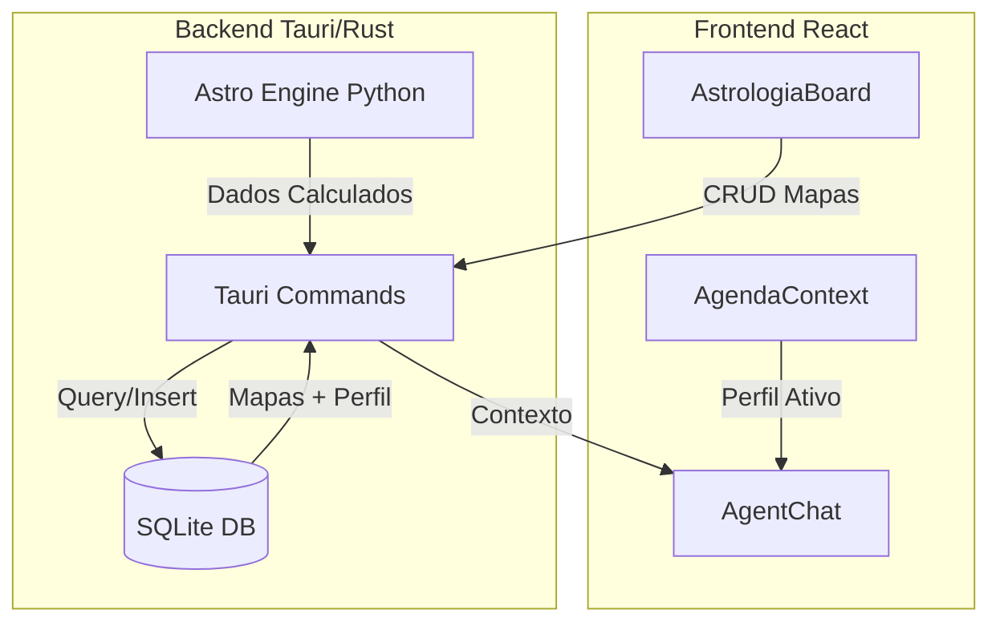

# Plano de Integração: Banco de Dados + Mapas Astrológicos + Perfil do Usuário

## Resumo Executivo

Este plano detalha a implementação de um banco de dados SQLite local para armazenar mapas astrológicos e enriquecer o perfil do usuário, permitindo que os agentes de IA acessem informações contextuais personalizadas.

---

## 1. Arquitetura da Solução

### 1.1 Stack Tecnológico
- **Banco de Dados:** SQLite (via `rusqlite` no Rust)
- **Migrations:** `refinery` para controle de versão do schema
- **ORM/Queries:** SQL direto com `rusqlite`
- **Localização:** `app_data_dir()/aurea_solaris.db`

### 1.2 Fluxo de Dados



---

## 2. Schema do Banco de Dados

### 2.1 Tabela: `profiles` (Estendida)
```sql
CREATE TABLE profiles (
    id TEXT PRIMARY KEY,
    name TEXT NOT NULL,
    email TEXT,
    password_hash TEXT,
    birth_date DATE,
    birth_time TIME,
    birth_location TEXT,
    -- Dados astrológicos natal
    natal_sun REAL,
    natal_moon REAL,
    natal_asc REAL,
    natal_mercury REAL,
    natal_venus REAL,
    natal_mars REAL,
    natal_jupiter REAL,
    natal_saturn REAL,
    -- Configurações
    preferences JSON,
    created_at TIMESTAMP DEFAULT CURRENT_TIMESTAMP,
    updated_at TIMESTAMP DEFAULT CURRENT_TIMESTAMP
);
```

### 2.2 Tabela: `astrology_maps`
```sql
CREATE TABLE astrology_maps (
    id TEXT PRIMARY KEY,
    profile_id TEXT NOT NULL,
    name TEXT NOT NULL,
    map_type TEXT CHECK(map_type IN ('natal', 'transit', 'progression', 'synastry')),
    calculation_date DATE,
    birth_location TEXT,
    latitude REAL,
    longitude REAL,
    timezone_offset REAL,
    -- Dados brutos do cálculo completo
    astro_data JSON NOT NULL,
    -- Posições planetárias precisas (graus 0-360)
    sun REAL, moon REAL, mercury REAL, venus REAL, mars REAL,
    jupiter REAL, saturn REAL, uranus REAL, neptune REAL, pluto REAL,
    chiron REAL, -- Quiron (ferida e cura)
    lilith REAL, -- Lilith (Lua Negra)
    part_of_fortune REAL, -- Parte da Fortuna
    -- Pontos angulares
    ascendant REAL, -- Ascendente
    mc REAL, -- Meio do Céu (Medium Coeli)
    dsc REAL, -- Descendente
    ic REAL, -- Fundo do Céu (Imum Coeli)
    -- Casas (sistema Placidus ou outro)
    house_1 REAL, house_2 REAL, house_3 REAL, house_4 REAL,
    house_5 REAL, house_6 REAL, house_7 REAL, house_8 REAL,
    house_9 REAL, house_10 REAL, house_11 REAL, house_12 REAL,
    -- Cálculos avançados
    alcocoden_planet TEXT, -- Planeta Alcocoden (vida)
    lord_of_geniture TEXT, -- Senhor da Genitura
    astrological_signature JSON, -- Assinatura astrológica (elementos, qualidades, polaridades)
    -- Hora sideral calculada
    sidereal_time REAL,
    -- Signos calculados
    sun_sign TEXT, moon_sign TEXT, asc_sign TEXT, mc_sign TEXT,
    dominant_element TEXT, dominant_quality TEXT,
    -- Metadados
    house_system TEXT DEFAULT 'Regiomontanus', -- Sistema de casas Regiomontano (precisão medieval)
    zodiac_type TEXT DEFAULT 'Tropical',
    notes TEXT,
    tags JSON,
    is_favorite BOOLEAN DEFAULT 0,
    created_at TIMESTAMP DEFAULT CURRENT_TIMESTAMP,
    updated_at TIMESTAMP DEFAULT CURRENT_TIMESTAMP,
    FOREIGN KEY (profile_id) REFERENCES profiles(id) ON DELETE CASCADE
);
```

### 2.3 Tabela: `profile_connections`
```sql
CREATE TABLE profile_connections (
    id TEXT PRIMARY KEY,
    profile_id TEXT NOT NULL,
    name TEXT NOT NULL,
    relationship_type TEXT,
    birth_date DATE,
    birth_time TIME,
    birth_location TEXT,
    natal_data JSON,
    notes TEXT,
    created_at TIMESTAMP DEFAULT CURRENT_TIMESTAMP,
    FOREIGN KEY (profile_id) REFERENCES profiles(id) ON DELETE CASCADE
);
```

### 2.4 Tabela: `agent_context_logs`
```sql
CREATE TABLE agent_context_logs (
    id INTEGER PRIMARY KEY AUTOINCREMENT,
    profile_id TEXT NOT NULL,
    agent_name TEXT NOT NULL,
    context_sent JSON NOT NULL,
    timestamp TIMESTAMP DEFAULT CURRENT_TIMESTAMP,
    FOREIGN KEY (profile_id) REFERENCES profiles(id) ON DELETE CASCADE
);
```

---

## 3. Comandos Tauri (Rust)

### 3.1 Profile Commands
```rust
#[tauri::command]
async fn db_get_profile(app: AppHandle, profile_id: String) -> Result<Option<Profile>, String>

#[tauri::command]
async fn db_save_profile(app: AppHandle, profile: Profile) -> Result<(), String>

#[tauri::command]
async fn db_update_natal_data(
    app: AppHandle, 
    profile_id: String, 
    natal_data: NatalData
) -> Result<(), String>
```

### 3.2 Astrology Map Commands
```rust
#[tauri::command]
async fn db_save_astrology_map(
    app: AppHandle,
    profile_id: String,
    name: String,
    map_type: String,
    astro_data: serde_json::Value
) -> Result<String, String> // returns map_id

#[tauri::command]
async fn db_get_astrology_maps(
    app: AppHandle,
    profile_id: String
) -> Result<Vec<AstrologyMap>, String>

#[tauri::command]
async fn db_get_astrology_map(
    app: AppHandle,
    map_id: String
) -> Result<Option<AstrologyMap>, String>

#[tauri::command]
async fn db_delete_astrology_map(
    app: AppHandle,
    map_id: String
) -> Result<(), String>

#[tauri::command]
async fn db_toggle_favorite_map(
    app: AppHandle,
    map_id: String
) -> Result<bool, String>
```

### 3.3 Context Commands (para Agentes)
```rust
#[tauri::command]
async fn db_get_agent_context(
    app: AppHandle,
    profile_id: String,
    agent_name: String
) -> Result<AgentContext, String>

#[tauri::command]
async fn db_log_agent_interaction(
    app: AppHandle,
    profile_id: String,
    agent_name: String,
    context: serde_json::Value
) -> Result<(), String>
```

---

## 4. Estruturas de Dados (Rust)

```rust
#[derive(Debug, Serialize, Deserialize)]
pub struct Profile {
    pub id: String,
    pub name: String,
    pub email: Option<String>,
    pub birth_date: Option<String>,
    pub birth_time: Option<String>,
    pub birth_location: Option<String>,
    pub natal_data: Option<NatalData>,
    pub preferences: Option<serde_json::Value>,
}

#[derive(Debug, Serialize, Deserialize)]
pub struct NatalData {
    pub sun: f64,
    pub moon: f64,
    pub asc: f64,
    pub mercury: Option<f64>,
    pub venus: Option<f64>,
    pub mars: Option<f64>,
    pub jupiter: Option<f64>,
    pub saturn: Option<f64>,
}

#[derive(Debug, Serialize, Deserialize)]
pub struct AstrologyMap {
    pub id: String,
    pub profile_id: String,
    pub name: String,
    pub map_type: MapType,
    pub calculation_date: String,
    pub astro_data: serde_json::Value,
    pub sun_sign: Option<String>,
    pub moon_sign: Option<String>,
    pub notes: Option<String>,
    pub is_favorite: bool,
    pub created_at: String,
}

#[derive(Debug, Serialize, Deserialize)]
pub enum MapType {
    Natal,
    Transit,
    Progression,
    Synastry,
}

#[derive(Debug, Serialize, Deserialize)]
pub struct AgentContext {
    pub profile: Profile,
    pub active_map: Option<AstrologyMap>,
    pub recent_maps: Vec<AstrologyMap>,
    pub transits: Option<serde_json::Value>,
    pub planetary_hour: Option<serde_json::Value>,
}
```

---

## 5. UI - AstrologiaBoard Atualizada

### 5.1 Novos Componentes

```typescript
// src/components/astrology/MapManager.tsx
interface MapManagerProps {
  profileId: string;
  onSelectMap: (map: AstrologyMap) => void;
  activeMapId?: string;
}

// src/components/astrology/MapCard.tsx
interface MapCardProps {
  map: AstrologyMap;
  isActive: boolean;
  onSelect: () => void;
  onDelete: () => void;
  onToggleFavorite: () => void;
}

// src/components/astrology/MapEditor.tsx
interface MapEditorProps {
  profileId: string;
  existingMap?: AstrologyMap;
  onSave: () => void;
  onCancel: () => void;
}
```

### 5.2 Layout Proposto

```
┌─────────────────────────────────────────────────────────────┐
│  A Roda do Tempo                    [+ Novo Mapa]          │
├─────────────────────────────────────────────────────────────┤
│                                                             │
│                    [MANDALA VIEW]                           │
│                      (ativo)                                │
│                                                             │
├─────────────────────────────────────────────────────────────┤
│  Meus Mapas                                                 │
│  ┌──────────┐ ┌──────────┐ ┌──────────┐ ┌──────────┐       │
│  │ ★ Natal  │ │ Trânsito │ │ Sinastria│ │  + Novo  │       │
│  │ ☉ ♎     │ │ 20/03    │ │ Maria    │ │          │       │
│  └──────────┘ └──────────┘ └──────────┘ └──────────┘       │
├─────────────────────────────────────────────────────────────┤
│  Efemérides Atuais                                          │
│  [Tabela de planetas...]                                    │
└─────────────────────────────────────────────────────────────┘
```

---

## 6. Integração com Agentes

### 6.1 Contexto Enriquecido para Agentes

```typescript
// src/utils/agentContext.ts
export const buildEnhancedAgentContext = async (
  profileId: string,
  agentName: string
): Promise<string> => {
  const context = await safeInvoke<AgentContext>('db_get_agent_context', {
    profile_id: profileId,
    agent_name: agentName
  });
  
  if (!context) return '';
  
  return `
═══════════════════════════════════════════════════
PERFIL DO USUÁRIO - ${context.profile.name}
═══════════════════════════════════════════════════

DADOS NATAIS:
- Sol: ${context.profile.natal_data?.sun}° ${getSign(context.profile.natal_data?.sun)}
- Lua: ${context.profile.natal_data?.moon}° ${getSign(context.profile.natal_data?.moon)}
- Ascendente: ${context.profile.natal_data?.asc}° ${getSign(context.profile.natal_data?.asc)}

MAPA ATIVO: ${context.active_map?.name || 'Nenhum'}
${context.active_map ? `- Tipo: ${context.active_map.map_type}
- Data do Cálculo: ${context.active_map.calculation_date}` : ''}

HISTÓRICO RECENTE:
${context.recent_maps.slice(0, 3).map(m => `- ${m.name} (${m.map_type})`).join('\n')}

NOTAS DO USUÁRIO:
${context.active_map?.notes || 'Nenhuma nota registrada'}
═══════════════════════════════════════════════════
`;
};
```

### 6.2 Atualização dos Personas

**Rafiki (Astrólogo Técnico):**
```
Você é RAFIKI - Astrólogo Técnico do Aurea Solaris.

CONTEXTO DO USUÁRIO:
{profile_context}

Ao interpretar, considere:
1. O mapa natal do usuário como base
2. O mapa ativo selecionado para temporalidade
3. Notas anteriores para continuidade
4. Padrões recorrentes nos mapas recentes
```

---

## 7. Implementação Passo a Passo

### Fase 1: Setup do Banco de Dados (Estimativa: 2h)
1. Adicionar dependências no `Cargo.toml`:
   - `rusqlite = { version = "0.32", features = ["bundled", "chrono"] }`
   - `refinery = { version = "0.8", features = ["rusqlite"] }`
   
2. Criar estrutura de migrations
3. Implementar conexão singleton do banco
4. Criar schema inicial

### Fase 2: Comandos Tauri (Estimativa: 3h)
1. Implementar comandos de profile
2. Implementar comandos de mapas
3. Implementar comandos de contexto
4. Adicionar tratamento de erros

### Fase 3: UI - Map Manager (Estimativa: 3h)
1. Criar componente `MapManager`
2. Criar componente `MapCard`
3. Criar modal `MapEditor`
4. Integrar com `AstrologiaBoard`

### Fase 4: Integração com Agentes (Estimativa: 2h)
1. Criar `agentContext.ts`
2. Atualizar `AgentChat` para carregar contexto
3. Atualizar personas com instruções de uso
4. Testar fluxo completo

### Fase 5: Migração de Dados (Estimativa: 1h)
1. Criar função para migrar profiles do localStorage
2. Criar função para migrar connections
3. Executar migração na inicialização

---

## 8. Cálculos Astrológicos Avançados (astro_engine.py)

### 8.1 Sistema de Casas Regiomontanus
O sistema Regiomontanus divide o equador em 12 partes iguais e projeta para o horizonte, criando casas de grande precisão para latitudes extremas.

**Características:**
- MC (Meio do Céu) = Cúspide da Casa 10
- Ascendente = Cúspide da Casa 1
- Círculo do equador dividido igualmente
- Projeção através do polo Norte

### 8.2 Cálculos Implementados

```python
# astro_engine.py - Funções principais

def calculate_sidereal_time(birth_dt: datetime, longitude: float, timezone_offset: float) -> float:
    """
    Calcula a hora sideral local precisa considerando:
    - Horário de verão (DST) via biblioteca pytz ou zoneinfo
    - Longitude do local de nascimento
    - Correção da equação do tempo
    - Nutação e precessão
    """
    pass

def get_house_cusps_regiomontanus(
    sidereal_time: float,
    latitude: float,
    obliquity: float
) -> List[float]:
    """
    Calcula as cúspides das 12 casas usando o sistema Regiomontano.
    Fórmula baseada na projeção do equador no horizonte local.
    """
    pass

def calculate_part_of_fortune(
    sun_pos: float,
    moon_pos: float,
    asc_pos: float,
    diurnal: bool
) -> float:
    """
    Parte da Fortuna (Pars Fortunae):
    - Dia: Asc + Lua - Sol
    - Noite: Asc + Sol - Lua
    """
    pass

def calculate_alcocoden(
    hyleg: str,
    planetary_positions: Dict[str, float],
    essential_dignities: Dict
) -> Tuple[str, float]:
    """
    Calcula o Alcocoden (planeta que determina a duração da vida):
    1. Identifica o Hyleg (ponto vital)
    2. Encontra o Alcocoden (planeta que rege o Hyleg)
    3. Calcula os anos de vida baseado nas dignidades
    """
    pass

def calculate_lord_of_geniture(
    planetary_positions: Dict[str, float],
    houses: List[float],
    essential_dignities: Dict
) -> str:
    """
    Senhor da Genitura (Lord of the Geniture):
    - Planeta mais fortificado no mapa
    - Considera: domicílio, exaltação, triplicidade, termo, face
    - Posição angular (especialmente ASC ou MC)
    - Aspectos benéficos
    """
    pass

def calculate_astrological_signature(
    planet_positions: Dict[str, float],
    houses: List[float]
) -> Dict:
    """
    Assinatura Astrológica:
    - Distribuição dos elementos (Fogo, Terra, Ar, Água)
    - Distribuição das qualidades (Cardinal, Fixo, Mutável)
    - Distribuição das polaridades (Yin/Yang)
    - Modo de operação predominante
    """
    return {
        "dominant_element": "Fire|Earth|Air|Water",
        "dominant_quality": "Cardinal|Fixed|Mutable",
        "polarity_balance": {"yin": 40, "yang": 60},
        "signature": "ex: Fogo Cardinal"  # Combinação element + quality
    }

def get_lilith_black_moon(date: datetime) -> float:
    """
    Calcula a posição da Lua Negra (Lilith):
    - Apogeu lunar médio (Lilith Média)
    - Ou posição osculante (Lilith Verdadeira)
    """
    pass

def get_chiron_position(date: datetime) -> float:
    """
    Posição de Quiron (cometa/asteroide):
    - Representa a ferida e o curandeiro
    - Órbita elíptica entre Saturno e Urano
    """
    pass
```

### 8.3 Precisão dos Cálculos

**Conversão de Horário:**
1. Receber data/hora local e timezone
2. Converter para UTC considerando DST (horário de verão)
3. Aplicar equação do tempo
4. Calcular hora sideral em Greenwich (GST)
5. Ajustar para longitude local (LST)

**Fórmula Hora Sideral:**
```
LST = GST + longitude/15
GST = 6h41m + (dias desde J2000 × 3m56s.5554)
```

**Sistema Regiomontanus:**
```
RAMC (Right Ascension of MC) = LST × 15
Cúspide Casa 10 = MC = RAMC
Cúspide Casa 1 = Ascendente
Para cada casa n (1-12):
  RA_n = RAMC + (n-1) × 30
  Cúspide = projeta RA_n no horizonte via polo Norte
```

---

## 9. Dependências a Adicionar

### Python (astro_engine.py)
```txt
swisseph==2.10.3.2  # Cálculos efemérides de alta precisão
pytz==2024.1        # Timezone e DST
```

**Nota:** `swisseph` é a biblioteca Python do Swiss Ephemeris (NASA-level precision)

### Rust (src-tauri/Cargo.toml)
```toml
[dependencies]
rusqlite = { version = "0.32", features = ["bundled", "chrono", "json"] }
refinery = { version = "0.8", features = ["rusqlite"] }
chrono = { version = "0.4", features = ["serde"] }
```

### Rust (`src-tauri/Cargo.toml`)
```toml
[dependencies]
rusqlite = { version = "0.32", features = ["bundled", "chrono", "json"] }
refinery = { version = "0.8", features = ["rusqlite"] }
chrono = { version = "0.4", features = ["serde"] }
```

### TypeScript (já existentes, nenhuma nova necessária)

---

## 9. Considerações de Segurança

1. **Isolamento de Dados:** Cada profile só acessa seus próprios mapas
2. **Validação:** Sanitizar inputs antes de queries
3. **Backup:** Permitir export/import do banco SQLite
4. **Senhas:** Usar bcrypt para hash de senhas quando implementado

---

## 10. Próximos Passos

1. **Aprovar este plano** com quaisquer ajustes necessários
2. **Switch para Code mode** para implementação
3. **Testar cada fase** antes de prosseguir
4. **Documentar** alterações na arquitetura

---

*Plano criado em: 2026-03-20*
*Arquiteto: Kilo Code*
